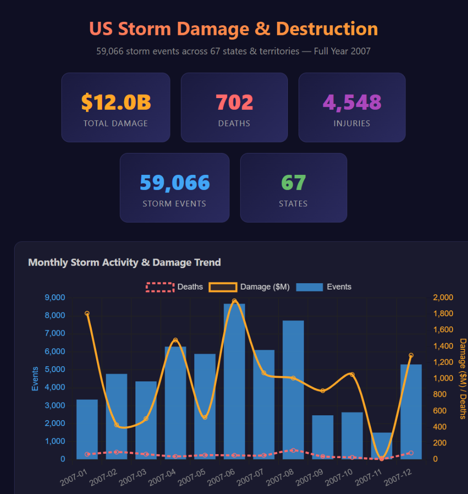
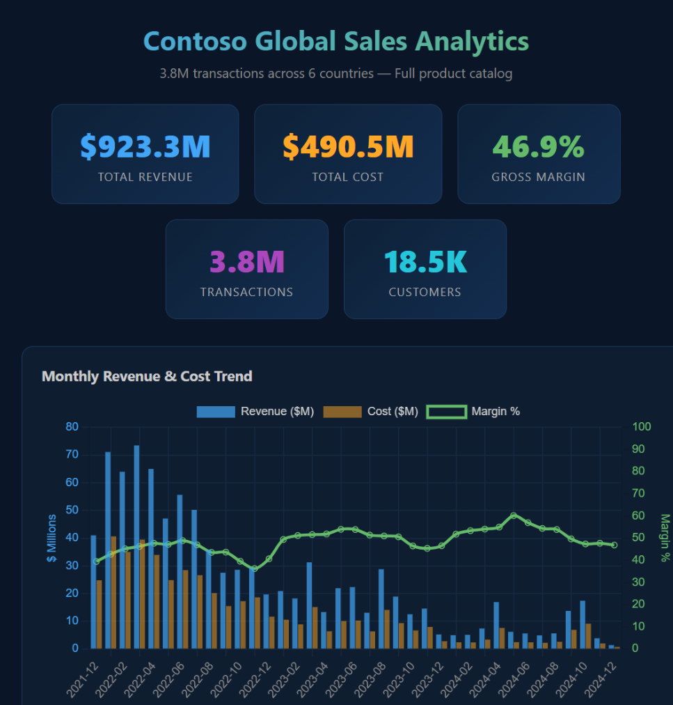
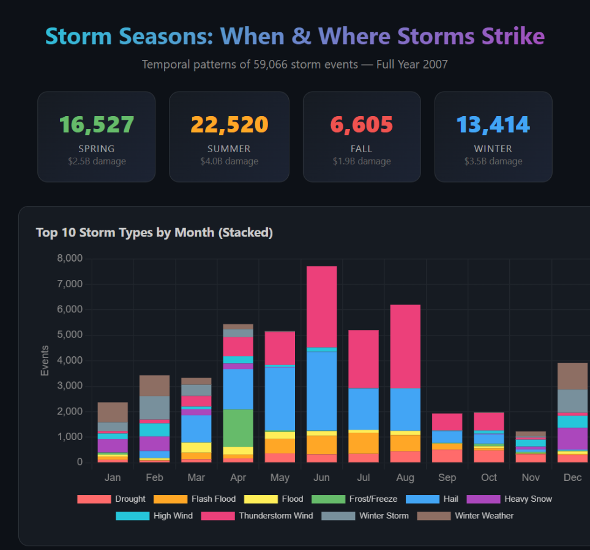

# yokusto — Natural Language Kusto Analytics in VS Code

Ask plain English questions about any Azure Data Explorer (Kusto) cluster and get a polished HTML dashboard - no KQL knowledge required.


---

## Quick Start (Python devs)

Already have [**VS Code**](https://code.visualstudio.com/) + [**Copilot**](https://marketplace.visualstudio.com/items?itemName=GitHub.copilot), [**Python 3.10+**](https://www.python.org/downloads/), and [**Azure CLI**](https://learn.microsoft.com/cli/azure/install-azure-cli)? Three commands:

```bash
git clone <this-repo> && cd yokusto
pip install azure-kusto-data azure-identity
az login --scope "https://kusto.kusto.windows.net/.default"
```

Open the folder in VS Code, type `@yokusto` in Copilot Chat, and go.

---
<details>
<summary><strong>Full setup (using Dev Container)</strong></summary>

## Easy Install (Dev Container)

**Option A — GitHub Codespaces (cloud, nothing to install)**

1. Click **Code → Codespaces → New codespace** on the repo page.
2. Wait for the container to build (~2 min). Python, Azure CLI, and pip packages are pre-installed.
3. Log in to Azure (device-code flow since Codespaces is headless):
   ```bash
   az login --use-device-code --scope "https://kusto.kusto.windows.net/.default"
   ```
4. Type `@yokusto` in Copilot Chat — done.

**Option B — VS Code + Docker (local)**

1. Install [Docker Desktop](https://www.docker.com/products/docker-desktop/) and the [Dev Containers extension](https://marketplace.visualstudio.com/items?itemName=ms-vscode-remote.remote-containers).
2. Open this repo in VS Code → `Ctrl+Shift+P` → **"Dev Containers: Reopen in Container"**.
3. Log in to Azure:
   ```bash
   az login --scope "https://kusto.kusto.windows.net/.default"
   ```
4. Type `@yokusto` in Copilot Chat — done.

> **Note:** The Dev Container pre-installs Python, Azure CLI, and pip packages, but `az login` is always required — Azure auth tokens are tied to your identity and can't be baked into a container.

---
</details>
<details>
<summary><strong>Full prerequisites (if not using Dev Container)</strong></summary>

| Requirement | How to get it |
|---|---|
| **VS Code** | [Download](https://code.visualstudio.com/) |
| **GitHub Copilot extension** | Install `GitHub.copilot` + `GitHub.copilot-chat` from Extensions |
| **GitHub Copilot subscription** | Free, Pro, or Enterprise |
| **Python 3.10+** | [Download](https://www.python.org/downloads/) |
| **Azure CLI** | [Install](https://learn.microsoft.com/en-us/cli/azure/install-azure-cli) |
| **Kusto cluster access** | Reader permissions on the cluster(s) you want to query |

</details>

### Verify the agent is loaded

Type `@` in Copilot Chat — you should see **yokusto** in the list. If not:
- Confirm `.github/agents/yokusto.agent.md` exists at the workspace root.
- Reload VS Code: `Ctrl+Shift+P` → **"Developer: Reload Window"**.

> **Different tenant?** Add `--tenant <TENANT_ID>` if your Kusto cluster lives in a specific tenant.

---

## 🎯 Try It Now — 3 Stunning Demos

These dashboards were generated entirely by yokusto from a single natural-language prompt each, using the **free public demo cluster** `https://help.kusto.windows.net`. No KQL written by hand.

### Demo 1 — US Storm Damage & Destruction

> **Prompt:** `@yokusto Show me storm damage by state, event type, and month from https://help.kusto.windows.net, database Samples, table StormEvents — include deaths, injuries, property damage $, and crop damage $`

**What you get:** A dark-themed dashboard with 5 KPI cards ($12B total damage, 702 deaths, 1,842 injuries, 59K events, 67 states), a dual-axis monthly trend (bars for event count, lines for damage $ and deaths), horizontal bar ranking of the 12 deadliest storm types, stacked property-vs-crop damage by state, a doughnut chart of fatalities by cause, and a detailed breakdown table.

📄 Output: [`storm_dashboard.html`](storm_dashboard.html)



---

### Demo 2 — Contoso Global Sales Analytics

> **Prompt:** `@yokusto Build a sales dashboard from https://help.kusto.windows.net, database ContosoSales — monthly revenue trend, top 10 countries, product category breakdown, margin analysis, and customer demographics`

**What you get:** A midnight-blue dashboard with 5 KPI cards ($923M revenue, $490M cost, 46.9% margin, 3.8M transactions, 18K customers), a revenue/cost/margin trend line, top-10 countries horizontal bar, grouped revenue-vs-cost by product category, gender doughnut, education bar chart, and a top-15 cities table.

📄 Output: [`sales_dashboard.html`](sales_dashboard.html)



---

### Demo 3 — Storm Seasons: When & Where Storms Strike

> **Prompt:** `@yokusto Analyze temporal storm patterns from https://help.kusto.windows.net, database Samples, table StormEvents — show seasonality, hourly patterns, storm duration by type, and busiest state×month combinations`

**What you get:** A GitHub-dark themed dashboard with seasonal KPI cards (Summer: 23K events/$3.5B, Spring: 18K/$5.1B, Fall: 11K/$2.4B, Winter: 6K/$915M), a stacked bar of the top 10 storm types across all 12 months, a polar area chart showing hour-of-day activity, a seasonal doughnut, average storm duration by type (droughts last 200+ hours!), and a state×month hotspot table.

📄 Output: [`seasons_dashboard.html`](seasons_dashboard.html)



---

> **Want to try?** Just paste any of the prompts above into Copilot Chat with `@yokusto` — or make up your own question. The agent discovers schema, writes KQL, runs it, and builds the dashboard automatically.

---

## Usage

Just tell yokusto **which cluster(s)** to connect to and **what you want to see**. Include one or more cluster URLs in your message — yokusto can query across multiple clusters in a single run.

### Option A — Conversational mode (recommended)

Type `@yokusto` followed by your question in plain English:

```
@yokusto Show me storm damage by state and event type from https://help.kusto.windows.net, database Samples, table StormEvents
```

```
@yokusto Build me a sales dashboard from https://help.kusto.windows.net, database ContosoSales — revenue by product category, top countries, monthly trend
```

```
@yokusto Join deployment data from https://cluster-a.kusto.windows.net (database Deployments) with revenue from https://cluster-b.kusto.windows.net (database Sales) and build a combined dashboard
```

```
@yokusto I know nothing about Kusto. Just explore https://help.kusto.windows.net and show me something interesting
```

This starts a back-and-forth conversation. You can ask follow-ups like:

```
@yokusto Now filter that to just Flood events in Texas
```

```
@yokusto Add a line chart showing the damage trend over time
```

### Option B — One-shot slash command

Type `/yokusto ask` followed by your question:

```
/yokusto ask What databases and tables exist on https://help.kusto.windows.net? Show me samples of the interesting ones
```

This fires a single request. The agent will discover schema, query data, and produce the HTML dashboard in one pass.

> **Tip:** Don't have a cluster? Use the free public demo cluster `https://help.kusto.windows.net` — it has several rich datasets including storm events, retail sales, NYC taxi trips, and IoT sensor data.
>
> **Multi-cluster:** You can reference as many clusters as you need in a single prompt. yokusto queries each one separately and joins the results in Python.

---

## What happens behind the scenes

You don't need to know any of this — the agent handles it all — but here's the flow:

1. **Bootstrap** — Checks that Python, packages, and Azure CLI auth are ready.
2. **Schema discovery** — Lists databases, tables, and columns on your cluster. Samples a few rows to understand the data shape.
3. **Query generation** — Writes a Python script that sends KQL queries to the cluster via `azure-kusto-data`.
4. **Execution** — Runs the script, batching large queries automatically and showing progress.
5. **Visualization** — Generates a self-contained HTML file with Chart.js charts, KPI cards, and formatted tables.
6. **Artifact preservation** — Saves the HTML dashboard, the Python script, and a `.kql` file with the working queries.

---

## Example prompts

All of these work against the free public demo cluster. Replace the URL with your own cluster for real data.

| What you want | What to type |
|---|---|
| Storm damage dashboard | `@yokusto Show me storm damage by state, event type, and month from https://help.kusto.windows.net, database Samples, table StormEvents — include deaths, property damage $, and crop damage $` |
| Retail sales analysis | `@yokusto Build a sales dashboard from https://help.kusto.windows.net, database ContosoSales — monthly revenue trend, top 10 countries, product category breakdown, and margin analysis` |
| Explore a new cluster | `@yokusto What databases and tables exist on https://help.kusto.windows.net? Show me the most interesting ones with samples` |
| NYC taxi trends | `@yokusto Show me daily taxi trip counts, average fare, and busiest boroughs from https://help.kusto.windows.net, database Samples, table Trips — limit to January 2014` |
| Cross-cluster join | `@yokusto Join deployment data from https://cluster-a.kusto.windows.net with revenue data from https://cluster-b.kusto.windows.net and make a dashboard` |
| Mix Kusto + local CSV | `@yokusto Join this Kusto data with the CSV in my repo and show a summary table` |
| Iterate on prior results | `@yokusto Rerun but filter to just Flood events in Texas` |
| Just get the KQL | `@yokusto Give me the KQL query for top 10 storm types by total damage, don't run it` |

---

## Outputs

After a successful run, the agent creates files in your workspace:

| File | Purpose |
|---|---|
| `<topic>_dashboard.html` | The HTML visualization — open in a browser |
| `run_<topic>.py` | The Python script that produced it — re-runnable |
| `<topic>.kql` | The working KQL queries — paste into Kusto Explorer if needed |

---

## Troubleshooting

### "403 Forbidden" or "Unauthorized"
Your Azure CLI is logged into the wrong tenant. Log in to the correct one:
```bash
az login --tenant <TENANT_ID> --scope "https://kusto.kusto.windows.net/.default"
```

### "ModuleNotFoundError: azure.kusto.data"
Install the packages:
```bash
pip install azure-kusto-data azure-identity
```

### Agent not visible in Chat
- Confirm `.github/agents/yokusto.agent.md` exists at the workspace root.
- Reload VS Code: `Ctrl+Shift+P` → "Developer: Reload Window".
- Update GitHub Copilot Chat extension to the latest version.

### Query times out
The agent handles this automatically — it increases timeouts and batches queries. If it still fails, the cluster may be overloaded. Try again or ask for a smaller time range.

### "I don't have access to this cluster"
You need at least **Viewer** permissions on the Kusto cluster. Ask your cluster admin to grant access, then re-run `az login`.

---

## Files in this repo

```
.devcontainer/
└── devcontainer.json            # Zero-install setup for Codespaces / Docker
.github/
├── agents/
│   └── yokusto.agent.md         # Agent definition (the brain)
└── prompts/
    └── yokusto.prompt.md        # Slash-command entry point
README.md                        # This file
run_demos.py                     # Generates the 3 showcase dashboards below
storm_dashboard.html             # Demo 1 — US Storm Damage & Destruction
sales_dashboard.html             # Demo 2 — Contoso Global Sales Analytics
seasons_dashboard.html           # Demo 3 — Storm Seasons: When & Where
```
