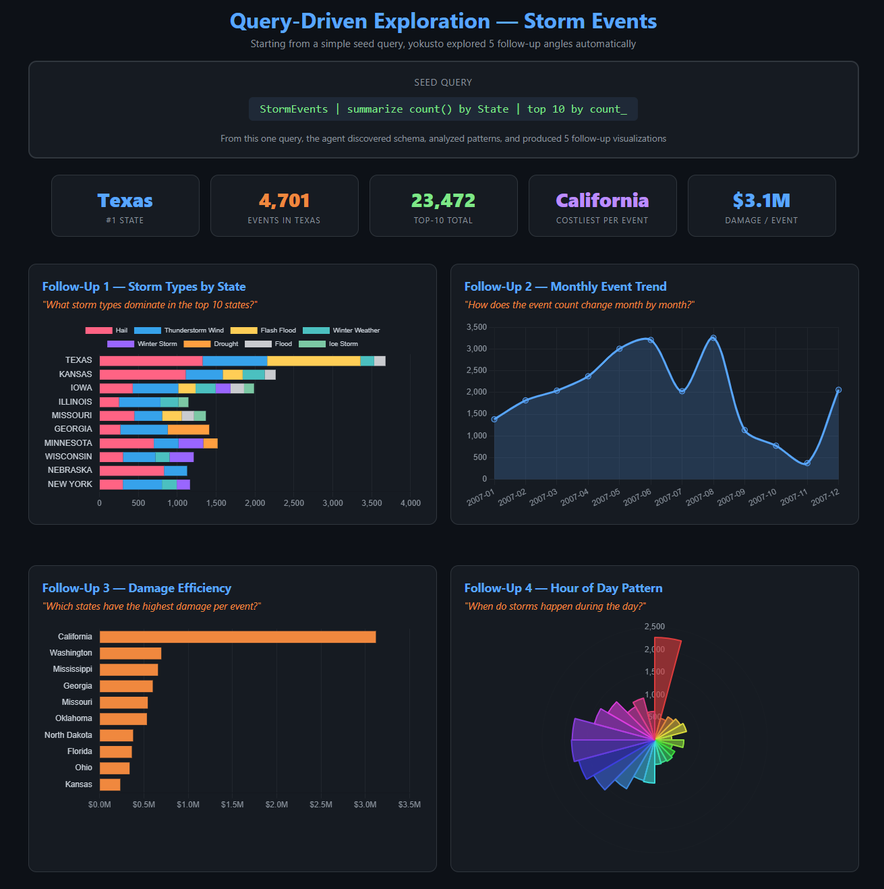
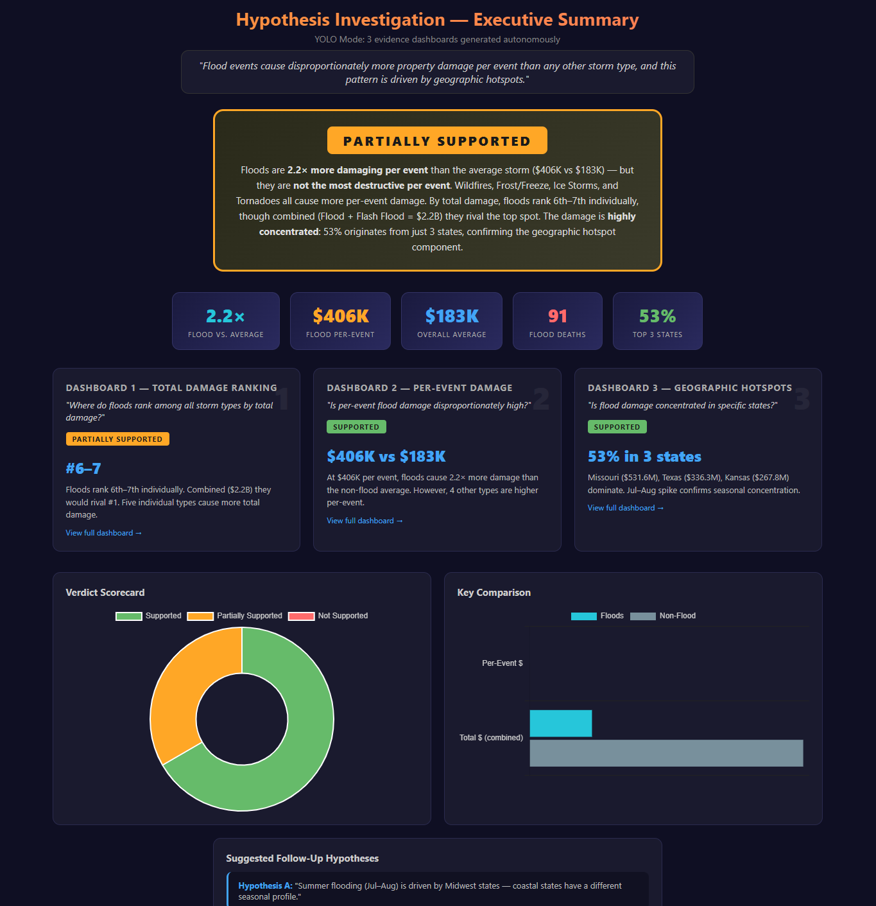

# yokusto — Talk to Kusto Clusters in Plain English

yokusto — a GitHub Copilot chat agent that turns plain-English questions about your Azure Data Explorer data into rich, shareable HTML dashboards. No KQL required.

Three modes depending on what you need:

| Mode | You have… | You get… |
|---|---|---|
| **Visualize** | A question about your data | A dashboard |
| **Explore** | An existing KQL query | Follow-up analyses + deeper insights |
| **Investigate** | A hypothesis to prove or disprove | Evidence dashboards + a verdict |

---

## Quick Start

```bash
git clone https://github.com/achandmsft/yokusto.git && cd yokusto
pip install azure-kusto-data azure-identity
az login --scope "https://kusto.kusto.windows.net/.default"
```

Open in VS Code → open Copilot Chat → select **yokusto** from the agent dropdown (top of the chat panel) → ask your question.

<details>
<summary>Dev Container / Codespaces setup</summary>

**Codespaces:** Click **Code → Codespaces → New codespace**. Wait ~2 min, then `az login --use-device-code --scope "https://kusto.kusto.windows.net/.default"`.

**Local Docker:** Install [Docker Desktop](https://www.docker.com/products/docker-desktop/) + [Dev Containers extension](https://marketplace.visualstudio.com/items?itemName=ms-vscode-remote.remote-containers) → `Ctrl+Shift+P` → "Reopen in Container" → `az login`.

</details>

<details>
<summary>Prerequisites</summary>

| Requirement | Link |
|---|---|
| VS Code | [Download](https://code.visualstudio.com/) |
| GitHub Copilot | [Extension](https://marketplace.visualstudio.com/items?itemName=GitHub.copilot) (Free, Pro, or Enterprise) |
| Python 3.10+ | [Download](https://www.python.org/downloads/) |
| Azure CLI | [Install](https://learn.microsoft.com/cli/azure/install-azure-cli) |

</details>

---

## The Three Modes

> **How to invoke:** Open Copilot Chat (`Ctrl+Alt+I`), click the agent dropdown at the top of the chat panel, select **yokusto**, then type your question. You can also use the slash command `/yokusto ask` followed by your question.

All examples below use the **free public cluster** `https://help.kusto.windows.net` — replace with your own cluster URL.

### 1. Visualize — ask a question, get a dashboard

Best for: exploring data you haven't seen before, building reports, one-off analysis.

> **Agent:** yokusto
>
> Show me storm damage by state and event type from https://help.kusto.windows.net, database Samples, table StormEvents


The agent discovers schema, writes KQL, runs it, and builds a self-contained HTML dashboard — KPI cards, charts, tables. One prompt, one dashboard.

📄 [Live demo](https://achandmsft.github.io/yokusto/projects/demo-visualize/storm_dashboard.html) · [Project files](projects/demo-visualize/)

---

### 2. Explore — start from a KQL query, go deeper

Best for: Kusto users who already have a query and want to discover what else the data can tell them.

> **Agent:** yokusto
>
> Here's a query I use:
> `StormEvents | summarize count() by State | top 10 by count_`
> Analyze this and show me what else is interesting



The agent runs your seed query, discovers the broader schema, and produces follow-up analyses automatically — then suggests next questions.

📄 [Live demo](https://achandmsft.github.io/yokusto/projects/demo-explore/query_exploration_dashboard.html) · [Project files](projects/demo-explore/)

---

### 3. Investigate — prove or disprove a hypothesis

Best for: validating a claim with data, building an evidence-based argument, due diligence.

> **Agent:** yokusto
>
> I think flood events cause disproportionately more damage per event than other storm types. Prove or disprove this using https://help.kusto.windows.net, database Samples, table StormEvents



The agent decomposes your claim into sub-questions, gathers evidence for and against, and delivers a verdict across multiple dashboards.

📄 [Live demo](https://achandmsft.github.io/yokusto/projects/demo-investigate/hypothesis_summary.html) · [Project files](projects/demo-investigate/)

---

## How It Works

Each session creates a self-contained project folder:

```
projects/<project-name>/
├── <topic>_dashboard.html     # Open in any browser — no server needed
├── run_<topic>.py             # Re-runnable Python script
├── render_<topic>_from_cache.py  # Regenerate HTML from cached data (no Kusto auth needed)
├── _<topic>_data.json         # Cached query results
└── <topic>.kql                # Working queries for Kusto Explorer
```

Share the HTML file via email, Teams, or SharePoint. Recipients just open it — no setup.

> **Your projects stay local by default.** The included `.gitignore` excludes all `projects/` HTML dashboards, JSON data caches, and any project folders you create from version control. Only the demo projects (which use the public `help.kusto.windows.net` cluster) are checked in. Your real analysis — queries, data, dashboards — never leaves your machine unless you explicitly override this.

<details>
<summary>Behind the scenes</summary>

1. Checks Python, packages, and Azure CLI auth
2. Discovers databases, tables, and columns on your cluster
3. Writes and runs a Python script that sends KQL queries via `azure-kusto-data`
4. Generates a self-contained HTML file with Chart.js charts and formatted tables
5. Saves the dashboard, script, and `.kql` file in a project folder

</details>

---

## Sharing & Privacy

> [!WARNING]
> **Dashboard HTML files contain your actual query results — real data from your Kusto cluster.** yokusto is designed as a local-first tool. Dashboards live on your machine and should be shared privately within your organization via **SharePoint, Teams, or Outlook** — the same way you'd handle any sensitive export.

If you choose to push dashboards to GitHub or enable GitHub Pages, **you are responsible for ensuring no private or proprietary data is exposed.** Proceed with extreme caution.

<details>
<summary>Advanced: team workflow with GitHub (read the warning above first)</summary>

> [!CAUTION]
> **GitHub Pages are always public** on Free/Pro/Team plans — even on private repos. Anyone with the URL can view your dashboards. Never enable Pages if your data contains PII, financial figures, internal metrics, or anything you wouldn't post on the open internet. [GitHub Enterprise Cloud](https://docs.github.com/en/enterprise-cloud@latest/pages/getting-started-with-github-pages/changing-the-visibility-of-your-github-pages-site) supports private Pages restricted to repo collaborators.

**Safe setup (dashboards stay local, only scripts are version-controlled):**

```bash
gh repo create my-yokusto --private --clone --template achandmsft/yokusto
cd my-yokusto
echo "projects/**/*.html" >> .gitignore   # keep dashboards out of git
```

**If you intentionally want public dashboards** (non-sensitive data only):

```bash
gh api repos/<you>/my-yokusto/pages -X POST -f build_type=legacy -f source.branch=main -f source.path="/"
```

**Pull upstream updates:**

```bash
git remote add upstream https://github.com/achandmsft/yokusto.git
git remote set-url --push upstream DISABLE
git fetch upstream && git merge upstream/main
```

</details>

---

## Troubleshooting

| Problem | Fix |
|---|---|
| 403 Forbidden | Wrong tenant: `az login --tenant <TENANT_ID> --scope "https://kusto.kusto.windows.net/.default"` |
| ModuleNotFoundError | `pip install azure-kusto-data azure-identity` |
| Agent not visible | Check `.github/agents/yokusto.agent.md` exists, reload VS Code |
| Query timeout | Agent handles this automatically; try a smaller time range if it persists |

---

<details>
<summary>Why is yokusto an agent and not a skill?</summary>

GitHub Copilot offers two extension points: **agents** (user-invoked, with their own identity and tools) and **skills** (reusable knowledge modules that agents can call). yokusto is a single agent — not an agent wrapping a skill — and this is a deliberate choice.

| Factor | Agent + Skill (split) | Single Agent (current) |
|---|---|---|
| **Reusability** | The skill could be invoked by other agents | yokusto's knowledge is highly specific (Kusto → HTML dashboards via Python) — no other agent would realistically invoke it |
| **Context loading** | Skill instructions only load when matched by description heuristics | Agent instructions only load when the user selects yokusto — same effect, no matching ambiguity |
| **Coherence** | Orchestration and domain knowledge split across two files — easy to drift apart | Everything in one place — mode selection, workflow, heuristics, visual style, error recovery all reference each other |
| **Mode selection** | The orchestrator would parse intent then delegate to the skill — adding a handoff seam | Mode selection flows directly into execution with no artificial boundary |
| **Maintenance** | Two files to keep in sync | One file, one source of truth |

**When would a split make sense?**
- If other agents needed Kusto → dashboard capabilities (e.g., a cost-optimization agent that also queries Kusto and renders HTML). The shared knowledge would become a genuine reusable skill.
- If the agent definition grew past ~1,000 lines and started hitting context window limits. At ~550 lines today, it's well within bounds.

For now, yokusto is a single-purpose agent with tightly coupled orchestration and domain knowledge. Splitting would add complexity without real reuse. The architecture can be revisited if shared Kusto querying capabilities are needed later.

</details>

---

## Files

```
.github/agents/yokusto.agent.md    # Agent definition (the brain)
.github/prompts/yokusto.prompt.md  # Slash-command entry point
.devcontainer/devcontainer.json    # Dev Container config
.gitignore                         # Keeps your projects local by default
projects/
├── demo-visualize/                # Mode 1 demo (safe to delete)
├── demo-explore/                  # Mode 2 demo (safe to delete)
└── demo-investigate/              # Mode 3 demo (safe to delete)
```
