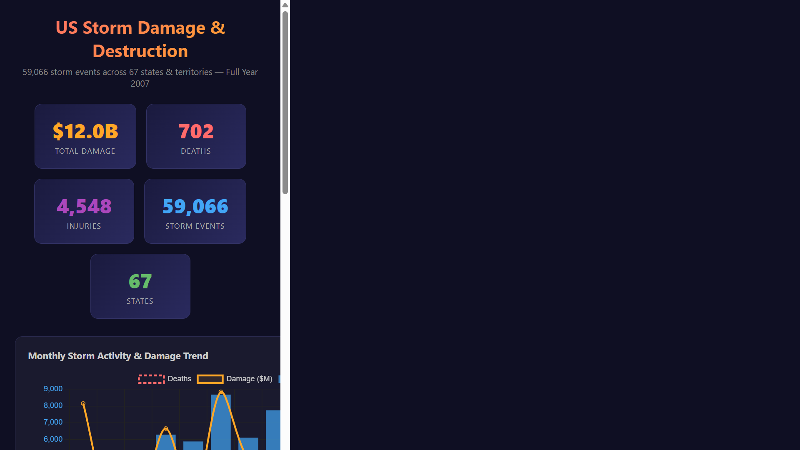
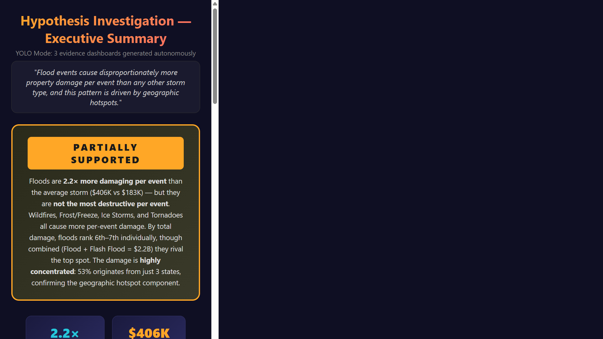

# yokusto — Natural Language Kusto Analytics in VS Code

Ask plain English questions about any Azure Data Explorer (Kusto) cluster and get a polished HTML dashboard - no KQL knowledge required.


---

## Quick Start

Already have [**VS Code**](https://code.visualstudio.com/) + [**Copilot**](https://marketplace.visualstudio.com/items?itemName=GitHub.copilot), [**Python 3.10+**](https://www.python.org/downloads/), and [**Azure CLI**](https://learn.microsoft.com/cli/azure/install-azure-cli)? Three commands:

```bash
git clone https://github.com/achandmsft/yokusto.git && cd yokusto
pip install azure-kusto-data azure-identity
az login --scope "https://kusto.kusto.windows.net/.default"
```

Open the folder in VS Code, type `@yokusto` in Copilot Chat, and go. Everything stays on your machine — dashboards, scripts, queries. Share the HTML files however you like (email, Teams, SharePoint).

---
<details>
<summary><strong>Full setup (using Dev Container)</strong></summary>

## Easy Install (Dev Container)

**Option A — GitHub Codespaces (cloud, nothing to install)**

1. Click **Code → Codespaces → New codespace** on the repo page.
2. Wait for the container to build (~2 min). Python, Azure CLI, and pip packages are pre-installed.
3. Log in to Azure (device-code flow since Codespaces is headless):
   ```bash
   az login --use-device-code --scope "https://kusto.kusto.windows.net/.default"
   ```
4. Type `@yokusto` in Copilot Chat — done.

**Option B — VS Code + Docker (local)**

1. Install [Docker Desktop](https://www.docker.com/products/docker-desktop/) and the [Dev Containers extension](https://marketplace.visualstudio.com/items?itemName=ms-vscode-remote.remote-containers).
2. Open this repo in VS Code → `Ctrl+Shift+P` → **"Dev Containers: Reopen in Container"**.
3. Log in to Azure:
   ```bash
   az login --scope "https://kusto.kusto.windows.net/.default"
   ```
4. Type `@yokusto` in Copilot Chat — done.

> **Note:** The Dev Container pre-installs Python, Azure CLI, and pip packages, but `az login` is always required — Azure auth tokens are tied to your identity and can't be baked into a container.

---
</details>
<details>
<summary><strong>Full prerequisites (if not using Dev Container)</strong></summary>

| Requirement | How to get it |
|---|---|
| **VS Code** | [Download](https://code.visualstudio.com/) |
| **GitHub Copilot extension** | Install `GitHub.copilot` + `GitHub.copilot-chat` from Extensions |
| **GitHub Copilot subscription** | Free, Pro, or Enterprise |
| **Python 3.10+** | [Download](https://www.python.org/downloads/) |
| **Azure CLI** | [Install](https://learn.microsoft.com/en-us/cli/azure/install-azure-cli) |
| **Kusto cluster access** | Reader permissions on the cluster(s) you want to query |

</details>

### Verify the agent is loaded

Type `@` in Copilot Chat — you should see **yokusto** in the list. If not:
- Confirm `.github/agents/yokusto.agent.md` exists at the workspace root.
- Reload VS Code: `Ctrl+Shift+P` → **"Developer: Reload Window"**.

> **Different tenant?** Add `--tenant <TENANT_ID>` if your Kusto cluster lives in a specific tenant.

---

## 🎯 Try It Now

All demos use the **free public cluster** `https://help.kusto.windows.net` — no setup beyond Quick Start.

---

### Demo 1 — Prompt → Dashboard (one question, one dashboard)

Ask a plain-English question, get a polished dashboard. No KQL required.

> **Prompt:** `@yokusto Show me storm damage by state, event type, and month from https://help.kusto.windows.net, database Samples, table StormEvents — include deaths, injuries, property damage $, and crop damage $`



**What you get:** A dark-themed dashboard with 5 KPI cards ($12B total damage, 702 deaths, 4,548 injuries, 59K events, 67 states), a dual-axis monthly trend, horizontal bar ranking of the deadliest storm types, stacked property-vs-crop damage by state, and a detailed breakdown table — all from a single prompt.

📄 [Open live dashboard](https://achandmsft.github.io/yokusto/projects/demo-basic/storm_dashboard.html) · [More demos in `projects/demo-basic/`](projects/demo-basic/) (sales analytics, storm seasonality)

---

### Demo 2 — Hypothesis Mode (validate or disprove a claim)

State a hypothesis and the agent autonomously decomposes it, gathers evidence across multiple dashboards, and delivers a verdict.

> **Prompt:** `@yokusto I think flood events cause disproportionately more damage per event than other storm types. Prove or disprove this using https://help.kusto.windows.net, database Samples, table StormEvents`



**What you get:** The agent enters **YOLO hypothesis mode** — it breaks the claim into 3 sub-questions (damage ranking, per-event normalization, geographic hotspots), runs all the queries, and produces **4 dashboards**: one per sub-question plus an executive summary with an overall verdict of **PARTIALLY SUPPORTED** — floods are 2.2× more damaging per event than average, but 4 other storm types are worse.

📄 [Open summary dashboard](https://achandmsft.github.io/yokusto/projects/demo-hypothesis/hypothesis_summary.html) · [Full project with all 4 dashboards](projects/demo-hypothesis/)

---

> **Want to try?** Paste either prompt into Copilot Chat with `@yokusto` — or make up your own. The agent discovers schema, writes KQL, runs it, and builds the dashboard automatically.

---

## Create Your Own Projects

Each Copilot Chat session becomes a self-contained project in a `projects/` subfolder — with its own dashboards, queries, and Python scripts. Everything stays local on your machine.

### How it works

1. **Start a new chat session** — type `@yokusto` followed by your question. The agent creates a project folder under `projects/` automatically (e.g., `projects/q4-revenue-analysis/`).
2. **Each project is self-contained** — the agent writes all artifacts into that folder:
   ```
   projects/q4-revenue-analysis/
   ├── run_q4_revenue.py              # Re-runnable Python script
   ├── q4_revenue_dashboard.html      # The visualization
   └── q4_revenue.kql                 # Working KQL queries
   ```
3. **Share the HTML file** — email it, drop it in Teams/Slack/SharePoint, or attach it to a ticket. Recipients just open it in a browser — no setup needed.

### Example workflow

```
# Session 1: Storm analysis
@yokusto Show me storm damage from https://help.kusto.windows.net, database Samples, table StormEvents
→ creates projects/storm-damage/

# Session 2: Sales deep-dive
@yokusto Build a sales dashboard from https://help.kusto.windows.net, database ContosoSales
→ creates projects/contoso-sales/

# Session 3: Your production cluster
@yokusto Show me daily active users from https://mycluster.kusto.windows.net, database Prod
→ creates projects/daily-active-users/
```

Over time your workspace becomes a portfolio of analytics projects — all queryable, re-runnable, and shareable.

> **Tip:** The `projects/demo-basic/` and `projects/demo-hypothesis/` folders are just showcases. Delete them anytime — the agent and setup files are unaffected.

---

### Advanced: Team workflow with a GitHub repo

For teams that want version-controlled projects with shared history, push your workspace to a **private** GitHub repo.

> **⚠️ IMPORTANT: Dashboard HTML files contain your actual query data.** If you enable GitHub Pages — even on a private repo — **the dashboards become public web pages visible to anyone with the URL.** Do not commit HTML dashboard files to GitHub if they contain sensitive or proprietary data.

**Safe setup:**

```bash
# 1. Create a private repo
gh repo create my-yokusto --private --clone --template achandmsft/yokusto
cd my-yokusto

# 2. Add a .gitignore to exclude dashboards from commits
echo "projects/**/*.html" >> .gitignore
```

This keeps your Python scripts and KQL queries version-controlled while dashboard HTML files stay local-only. Share dashboards via Teams/SharePoint/email instead.

**If you intentionally want public dashboards** (non-sensitive data only):

```bash
# Remove the HTML exclusion from .gitignore, then:
gh api repos/<you>/my-yokusto/pages -X POST -f build_type=legacy -f source.branch=main -f source.path="/"
```

Every dashboard becomes a shareable URL:
`https://<you>.github.io/my-yokusto/projects/<project-name>/<topic>_dashboard.html`

> **Privacy reminder:** GitHub Pages on Free/Pro/Team plans are **always public**, even on private repos. [GitHub Enterprise Cloud](https://docs.github.com/en/enterprise-cloud@latest/pages/getting-started-with-github-pages/changing-the-visibility-of-your-github-pages-site) supports private Pages restricted to repo collaborators.

**Pulling upstream updates:**

```bash
git remote add upstream https://github.com/achandmsft/yokusto.git
git remote set-url --push upstream DISABLE
git fetch upstream && git merge upstream/main
```

---

## Usage

Just tell yokusto **which cluster(s)** to connect to and **what you want to see**. Include one or more cluster URLs in your message — yokusto can query across multiple clusters in a single run.

### Option A — Conversational mode (recommended)

Type `@yokusto` followed by your question in plain English:

```
@yokusto Show me storm damage by state and event type from https://help.kusto.windows.net, database Samples, table StormEvents
```

```
@yokusto Build me a sales dashboard from https://help.kusto.windows.net, database ContosoSales — revenue by product category, top countries, monthly trend
```

```
@yokusto Join deployment data from https://cluster-a.kusto.windows.net (database Deployments) with revenue from https://cluster-b.kusto.windows.net (database Sales) and build a combined dashboard
```

```
@yokusto I know nothing about Kusto. Just explore https://help.kusto.windows.net and show me something interesting
```

This starts a back-and-forth conversation. You can ask follow-ups like:

```
@yokusto Now filter that to just Flood events in Texas
```

```
@yokusto Add a line chart showing the damage trend over time
```

### Option B — One-shot slash command

Type `/yokusto ask` followed by your question:

```
/yokusto ask What databases and tables exist on https://help.kusto.windows.net? Show me samples of the interesting ones
```

This fires a single request. The agent will discover schema, query data, and produce the HTML dashboard in one pass.

> **Tip:** Don't have a cluster? Use the free public demo cluster `https://help.kusto.windows.net` — it has several rich datasets including storm events, retail sales, NYC taxi trips, and IoT sensor data.
>
> **Multi-cluster:** You can reference as many clusters as you need in a single prompt. yokusto queries each one separately and joins the results in Python.

---

## What happens behind the scenes

You don't need to know any of this — the agent handles it all — but here's the flow:

1. **Bootstrap** — Checks that Python, packages, and Azure CLI auth are ready.
2. **Schema discovery** — Lists databases, tables, and columns on your cluster. Samples a few rows to understand the data shape.
3. **Query generation** — Writes a Python script that sends KQL queries to the cluster via `azure-kusto-data`.
4. **Execution** — Runs the script, batching large queries automatically and showing progress.
5. **Visualization** — Generates a self-contained HTML file with Chart.js charts, KPI cards, and formatted tables.
6. **Artifact preservation** — Saves the HTML dashboard, the Python script, and a `.kql` file with the working queries.

---

## Example prompts

All of these work against the free public demo cluster. Replace the URL with your own cluster for real data.

| What you want | What to type |
|---|---|
| Storm damage dashboard | `@yokusto Show me storm damage by state, event type, and month from https://help.kusto.windows.net, database Samples, table StormEvents — include deaths, property damage $, and crop damage $` |
| Retail sales analysis | `@yokusto Build a sales dashboard from https://help.kusto.windows.net, database ContosoSales — monthly revenue trend, top 10 countries, product category breakdown, and margin analysis` |
| Explore a new cluster | `@yokusto What databases and tables exist on https://help.kusto.windows.net? Show me the most interesting ones with samples` |
| NYC taxi trends | `@yokusto Show me daily taxi trip counts, average fare, and busiest boroughs from https://help.kusto.windows.net, database Samples, table Trips — limit to January 2014` |
| Cross-cluster join | `@yokusto Join deployment data from https://cluster-a.kusto.windows.net with revenue data from https://cluster-b.kusto.windows.net and make a dashboard` |
| Mix Kusto + local CSV | `@yokusto Join this Kusto data with the CSV in my repo and show a summary table` |
| Iterate on prior results | `@yokusto Rerun but filter to just Flood events in Texas` |
| Just get the KQL | `@yokusto Give me the KQL query for top 10 storm types by total damage, don't run it` |

---

## Outputs

After a successful run, the agent creates a project folder with these files:

```
projects/<project-name>/
├── <topic>_dashboard.html      # The HTML visualization — open in a browser
├── run_<topic>.py              # The Python script — re-runnable and editable
└── <topic>.kql                 # Working KQL queries — paste into Kusto Explorer
```

---

## Sharing Dashboards

Every dashboard is a **self-contained HTML file** — no server required, no dependencies. Recipients just double-click to open.

| Method | How | Best for |
|---|---|---|
| **Email** | Attach the `.html` file | Quick one-off shares |
| **Teams / Slack** | Drag the file into a channel or chat | Team collaboration |
| **SharePoint / OneDrive** | Upload to a shared folder | Persistent access with org permissions |
| **GitHub Pages** | Push to repo, enable Pages | Public dashboards only — see warning below |

> **⚠️ GitHub Pages are always public** on Free/Pro/Team plans — even on private repos. Never push dashboard HTML files containing sensitive data to a GitHub repo with Pages enabled. The agent will warn you before committing HTML files.

---

## Troubleshooting

### "403 Forbidden" or "Unauthorized"
Your Azure CLI is logged into the wrong tenant. Log in to the correct one:
```bash
az login --tenant <TENANT_ID> --scope "https://kusto.kusto.windows.net/.default"
```

### "ModuleNotFoundError: azure.kusto.data"
Install the packages:
```bash
pip install azure-kusto-data azure-identity
```

### Agent not visible in Chat
- Confirm `.github/agents/yokusto.agent.md` exists at the workspace root.
- Reload VS Code: `Ctrl+Shift+P` → "Developer: Reload Window".
- Update GitHub Copilot Chat extension to the latest version.

### Query times out
The agent handles this automatically — it increases timeouts and batches queries. If it still fails, the cluster may be overloaded. Try again or ask for a smaller time range.

### "I don't have access to this cluster"
You need at least **Viewer** permissions on the Kusto cluster. Ask your cluster admin to grant access, then re-run `az login`.

---

## Files in this repo

```
.devcontainer/
└── devcontainer.json              # Zero-install setup for Codespaces / Docker
.github/
├── agents/
│   └── yokusto.agent.md           # Agent definition (the brain)
└── prompts/
    └── yokusto.prompt.md          # Slash-command entry point
projects/
├── demo-basic/                     # 3 showcase dashboards (safe to delete)
│   ├── README.md
│   ├── run_demos.py
│   ├── storm_dashboard.html
│   ├── sales_dashboard.html
│   ├── seasons_dashboard.html
│   └── images/
└── demo-hypothesis/                # YOLO hypothesis mode demo (safe to delete)
    ├── README.md
    ├── run_hypothesis_demo.py
    ├── hypothesis_summary.html
    ├── hypothesis_01_ranking.html
    ├── hypothesis_02_per_event.html
    ├── hypothesis_03_geographic.html
    └── images/
README.md                          # This file
```
